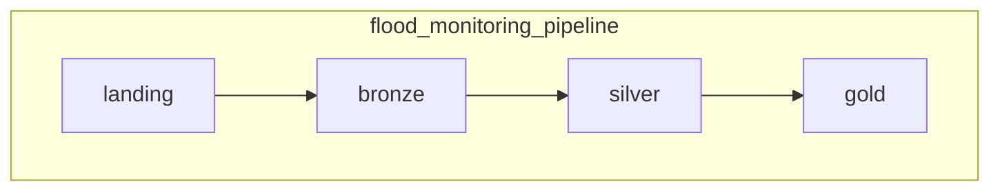
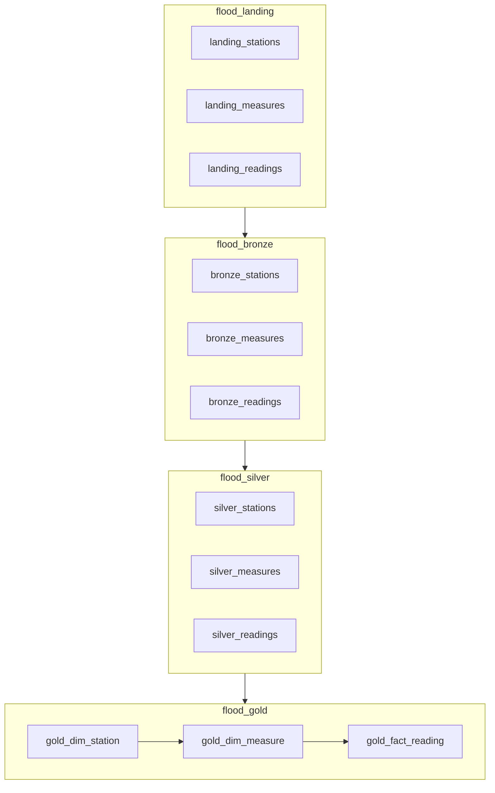

# flood-monitoring-pipeline

A Databricks pipeline that ingests Environment Agency real-time flood monitoring data
([environment.data.gov.uk/flood-monitoring](https://environment.data.gov.uk/flood-monitoring))
into a medallion lakehouse on Unity Catalog.

## What it does

Three API endpoints are polled on a schedule: the station list, the measure list, and the
day's readings. Every response is written to a landing volume exactly as received, then
promoted through bronze and silver into a gold star schema. Rows that fail validation go to `silver.quarantine`
with a reason rather than being dropped, so the rest of the batch still loads. Every run
writes a row to `ops.pipeline_run_log`, whether it succeeds or fails.

## Architecture

```
API -> landing volume -> bronze -> silver -> gold
                                     |
                                     +-> silver.quarantine (rows that fail validation)
```

| Schema | Contents | Built? |
|---|---|---|
| `landing` | `raw_files` volume: `stations/`, `measures/`, `readings/`, partitioned by run date | yes |
| `bronze` | `stations`, `measures`, `readings` — landing files in Delta with ingestion metadata, no business rules | yes |
| `silver` | `stations`, `measures`, `readings` — typed, validated, deduplicated; plus `quarantine` | yes |
| `gold` | `dim_station`, `dim_measure`, `fact_reading` — star schema with deterministic surrogate keys | yes |
| `ops` | `pipeline_run_log`, `measure_watermark` | yes |
| `sandbox` | free space for data scientists | yes |

## Task graph

Orchestration is one parent job per run, calling a child job per layer in sequence. Within
a layer the three entities run in parallel.



Each box is a child job. In full:



Within landing, bronze and silver the three tasks have no dependencies on each other, so
they run in parallel. Gold is sequential: the fact table needs the measure keys, and the
measure dimension checks each measure against a current station.

The trade-off: each layer now waits for the whole previous layer to finish rather than for
its own entity's predecessor, which costs a few minutes per run, in exchange for a clearer
structure and the ability to run or repair one layer on its own.

The catch-up task for silent stations is not in the job yet.

## Repository layout

```
notebooks/
├── 00_explore_api.py            one-off API exploration
├── 01_setup_unity_catalog.sql   catalog, schemas, volume, ops tables
├── common/                      helpers loaded with %run
├── landing/                     02a, 02b, 02c
├── bronze/                      03a, 03b, 03c
├── silver/                      04a, 04b, 04c
└── gold/                        05a, 05b, 05c
resources/databricks.yml         Asset Bundle: orchestrator, layer jobs, targets
.github/workflows/ci.yml         lint and config checks
```

Helpers live in `common/` and are loaded as `%run ../common/<name>`. That path is relative
to the calling notebook, so a notebook cannot be moved between folders without updating it;
CI checks every `%run` target resolves.

## How to run

1. Import the notebooks into Databricks.
2. Run `notebooks/01_setup_unity_catalog.sql` once to create the catalog, schemas, volume
   and ops tables.
3. Deploy and run the job:

   ```bash
   databricks bundle deploy -t dev
   databricks bundle run flood_monitoring_pipeline -t dev
   ```

The job takes four parameters: `catalog`, `mode` (`incremental` or `backfill`),
`lookback_days`, and `run_id`. It is scheduled every three hours, Europe/London.

## Environments

Three targets are defined — `dev`, `test` and `prod` — but only `dev` is deployed, because
this runs on Databricks Free Edition, which is a single workspace. The targets differ only
in the catalog they write to and whether the schedule is live, so promotion is a deploy,
not a code change.

| Target | Catalog | Schedule |
|---|---|---|
| `dev` | `flood_monitoring_dev` | paused |
| `test` | `flood_monitoring_test` | paused |
| `prod` | `flood_monitoring` | live |

In a real deployment each target would be its own workspace, and only CI would deploy to
`test` and `prod`.

Group grants in `01_setup_unity_catalog.sql` and the job permissions on the `prod` target
are commented out for the same reason: Free Edition cannot create account groups, so those
statements fail with a principal-not-found error. Both are left in place as documentation.

## Design decisions

- **Landing volume before bronze** — _(to fill in)_
- **Quarantine instead of dropping bad rows** — _(to fill in)_
- **Watermark per measure** — _(to fill in)_
- **One run at a time** — _(to fill in)_
- **A child job per layer rather than one flat task graph** — _(to fill in)_

## How this was built

Implemented with AI assistance; the pipeline design, the API behaviour it relies on, and
all notebook logic were reviewed and verified against a live workspace.

## Licence

Environment Agency flood monitoring data is licensed under the
[Open Government Licence v3.0](https://www.nationalarchives.gov.uk/doc/open-government-licence/version/3/).
