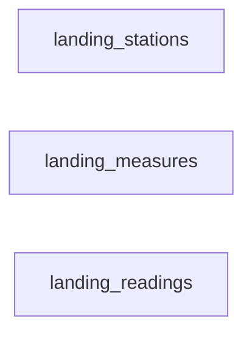

# flood-monitoring-pipeline

A Databricks pipeline that ingests Environment Agency real-time flood monitoring data
([environment.data.gov.uk/flood-monitoring](https://environment.data.gov.uk/flood-monitoring))
into a medallion lakehouse on Unity Catalog.

## What it does

Three API endpoints are polled on a schedule: the station list, the measure list, and
the day's readings. Every response is written to a landing volume exactly as received,
then promoted through bronze, silver and gold. Rows that fail validation are quarantined
rather than dropped, and every run writes a row to `ops.pipeline_run_log`.

## Architecture

```
API -> landing volume -> bronze -> silver -> gold
                                     |
                                     +-> quarantine (rows that fail validation)
```

| Schema | Holds |
|---|---|
| `landing` | Raw API responses in the `raw_files` volume, partitioned by run date |
| `bronze` | Landing files loaded into Delta with ingestion metadata, no business rules |
| `silver` | Typed, validated, deduplicated; rejected rows go to quarantine tables |
| `gold` | `dim_station`, `dim_measure`, `fact_reading` |
| `ops` | `pipeline_run_log`, `measure_watermark` |
| `sandbox` | Free space for data scientists |

## Task graph

Only the landing layer is orchestrated so far. The three endpoints are independent, so
they run in parallel and retry individually.



Bronze, silver, gold and the catch-up task are added to the same job as each layer lands.

## How to run

1. Import the notebooks into Databricks.
2. Run `notebooks/01_setup_unity_catalog.sql` once to create the catalog, schemas,
   volume and ops tables.
3. Deploy the job from `resources/`:

   ```bash
   databricks bundle deploy -t dev
   databricks bundle run flood_monitoring_pipeline -t dev
   ```

## Environments

Three targets are defined — `dev`, `test` and `prod` — but only `dev` is deployed,
because this runs on Databricks Free Edition, which is a single workspace. The targets
differ only in the catalog they write to and whether the schedule is live, so promotion
is a deploy, not a code change.

| Target | Catalog | Schedule |
|---|---|---|
| `dev` | `flood_monitoring_dev` | paused |
| `test` | `flood_monitoring_test` | paused |
| `prod` | `flood_monitoring` | live |

In a real deployment each target would be its own workspace, and only CI would deploy to
`test` and `prod`.

## Design decisions

- **Landing volume before bronze** — _(to fill in)_
- **Quarantine instead of dropping bad rows** — _(to fill in)_
- **Watermark per measure** — _(to fill in)_
- **One run at a time** — _(to fill in)_

## How this was built

Implemented with AI assistance; the pipeline design, the API behaviour it relies on, and
all notebook logic were reviewed and verified against a live workspace.

## Licence

Environment Agency flood monitoring data is licensed under the
[Open Government Licence v3.0](https://www.nationalarchives.gov.uk/doc/open-government-licence/version/3/).
