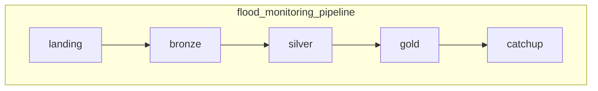
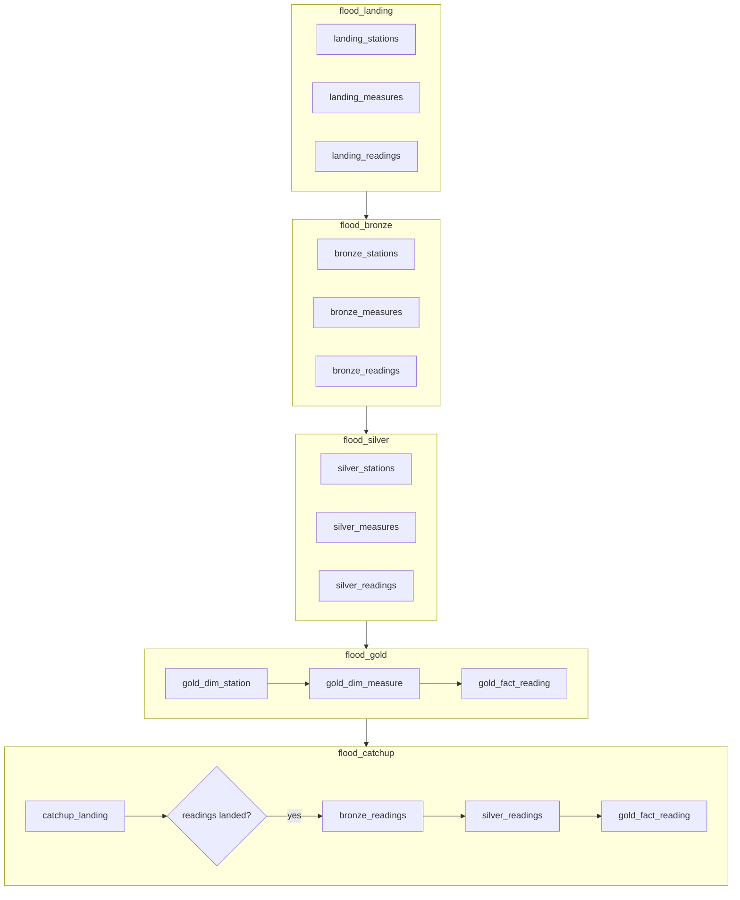

# flood-monitoring-pipeline

A Databricks pipeline that ingests Environment Agency real-time flood monitoring data
([environment.data.gov.uk/flood-monitoring](https://environment.data.gov.uk/flood-monitoring))
into a medallion lakehouse on Unity Catalog.

## What it does

Three API endpoints are polled on a schedule: the station list, the measure list, and the
day's readings. Every response is written to a landing volume exactly as received, then
promoted through bronze and silver into a gold star schema. Rows that fail validation go to `silver.quarantine`
with a reason rather than being dropped, so the rest of the batch still loads. Every run
writes a row to `ops.pipeline_run_log`, whether it succeeds or fails.

## Architecture

```
API -> landing volume -> bronze -> silver -> gold
                                     |
                                     +-> silver.quarantine (rows that fail validation)
```

| Schema | Contents | Built? |
|---|---|---|
| `landing` | `raw_files` volume: `stations/`, `measures/`, `readings/`, partitioned by run date | yes |
| `bronze` | `stations`, `measures`, `readings` — landing files in Delta with ingestion metadata, no business rules | yes |
| `silver` | `stations`, `measures`, `readings` — typed, validated, deduplicated; plus `quarantine` | yes |
| `gold` | `dim_station`, `dim_measure`, `fact_reading` — star schema with deterministic surrogate keys | yes |
| `ops` | `pipeline_run_log`, `measure_watermark` | yes |
| `sandbox` | free space for data scientists | yes |

## Task graph

Orchestration is one parent job per run, calling a child job per layer in sequence. Within
a layer the three entities run in parallel.



Each box is a child job. In full:



Within landing, bronze and silver the three tasks have no dependencies on each other, so
they run in parallel. Gold is sequential: the fact table needs the measure keys, and the
measure dimension checks each measure against a current station.

The trade-off: each layer now waits for the whole previous layer to finish rather than for
its own entity's predecessor, which costs a few minutes per run, in exchange for a clearer
structure and the ability to run or repair one layer on its own.

The catch-up job handles stations that went silent for longer than the three-day window and then resumed. Only
its first step is new code: it finds measures where the API is ahead of our watermark, fetches them with
`since=<watermark>`, and lands the readings exactly like the daily ones. The job then runs the same bronze, silver
and gold readings notebooks on them, so there is one set of cleaning rules and one `MERGE`. It runs with its own
`run_id` (`<run>-catchup`), and its downstream tasks are skipped when nothing needed catching up.

## Repository layout

```
notebooks/
├── 00_explore_api.py            one-off API exploration
├── 01_setup_unity_catalog.sql   catalog, schemas, volume, ops tables
├── common/                      helpers loaded with %run
├── landing/                     02a, 02b, 02c
├── bronze/                      03a, 03b, 03c
├── silver/                      04a, 04b, 04c
└── gold/                        05a, 05b, 05c
resources/databricks.yml         Asset Bundle: orchestrator, layer jobs, targets
.github/workflows/ci.yml         lint and config checks
```

Transformations are SQL (`spark.sql`); Python is used only for the API calls, widgets and the run log. Helpers live
in `common/` and are loaded as `%run ../common/<name>`: `00_pipeline_common` (run id and run log, used everywhere),
`00_landing_common` (HTTP with retries and the truncation check), `00_bronze_common` (reading landed files and
reconciling counts), and `00_silver_common` (the cleaning rules as SQL functions: `parse_double`, `first_element`,
`last_segment`). That path is relative
to the calling notebook, so a notebook cannot be moved between folders without updating it;
CI checks every `%run` target resolves.

## How to run

1. Import the notebooks into Databricks.
2. Run `notebooks/01_setup_unity_catalog.sql` once to create the catalog, schemas, volume
   and ops tables.
3. Deploy and run the job:

   ```bash
   databricks bundle deploy -t dev
   # first run: load the past week
   databricks bundle run flood_monitoring_pipeline -t dev --params mode=backfill
   # every run after that re-fetches the last three days (the schedule does this every three hours)
   databricks bundle run flood_monitoring_pipeline -t dev
   ```

The job takes four parameters: `catalog`, `mode` (`incremental` or `backfill`),
`lookback_days`, and `run_id`. It is scheduled every three hours, Europe/London.

## Environments

Three targets are defined — `dev`, `test` and `prod` — but only `dev` is deployed, because
this runs on Databricks Free Edition, which is a single workspace. The targets differ only
in the catalog they write to and whether the schedule is live, so promotion is a deploy,
not a code change.

| Target | Catalog | Schedule |
|---|---|---|
| `dev` | `flood_monitoring_dev` | paused |
| `test` | `flood_monitoring_test` | paused |
| `prod` | `flood_monitoring` | live |

In a real deployment each target would be its own workspace, and only CI would deploy to
`test` and `prod`.

Group grants in `01_setup_unity_catalog.sql` and the job permissions on the `prod` target
are commented out for the same reason: Free Edition cannot create account groups, so those
statements fail with a principal-not-found error. Both are left in place as documentation.

## Design decisions

- **One bulk call per day, not one call per station.** `/data/readings?date=` returns every station's readings for a
  day (about 490,000 rows in 14 seconds), so a week is 7 calls instead of 5,531 per day. Per-station `since` calls
  are used only to catch up stations that went silent.
- **Re-fetch the last three days on every run.** Stations send data once or twice a day, so readings arrive late.
  Rebuilding recent days picks them up, and the idempotent `MERGE` makes the overlap harmless.
- **Every API response is checked for truncation.** The API cuts results off at `meta.limit` without an error, so a
  response that reaches the limit fails the run rather than loading partial data.
- **Landing and Bronze keep the data exactly as received.** Raw JSON is kept as files and as `raw_item`, and every
  Bronze value is a string, so a parsing fix can be replayed without re-downloading. Unexpected fields are recorded
  in `unexpected_fields` as drift instead of breaking the load.
- **Quarantine instead of dropping bad rows.** Rows that fail validation go to `silver.quarantine` with a reason and
  the original item; the rest of the batch still loads.
- **`dim_station` is SCD Type 2, `dim_measure` is Type 1.** Station status and labels change and flood analysis is
  historical; measure metadata is static reference data.
- **A watermark per measure.** It is what detects a station that resumed after a long silence.
- **One run at a time.** Two runs merging the same days would contend for the same rows, so runs queue.
- **A child job per layer.** Each layer can be run or repaired on its own, at the cost of a few minutes per run.

## Tests

`tests/` runs every notebook, unchanged, on open-source Spark against fixture API responses that reproduce the quirks
found in the real API: status as text or a list, missing coordinates, pipe-joined and list values, missing and
non-numeric values, bad timestamps, a station with no reference, duplicate references and an unexpected new field.
The scenario is a first run, a second run that re-fetches the same days with a corrected value and late readings,
then a catch-up run. Failure tests cover a truncated API response and a Bronze count mismatch, which must fail the
run and be recorded in the run log. CI runs them on every pull request (`pytest`, about two minutes).

Delta-only statements (`MERGE`, `INSERT ... REPLACE WHERE`) are emulated locally with the same semantics; everything
else, including every `SELECT` and SQL function, runs on real Spark.

## How this was built

Implemented with AI assistance; the pipeline design, the API behaviour it relies on, and
all notebook logic were reviewed and verified against a live workspace.

## Licence

Environment Agency flood monitoring data is licensed under the
[Open Government Licence v3.0](https://www.nationalarchives.gov.uk/doc/open-government-licence/version/3/).
